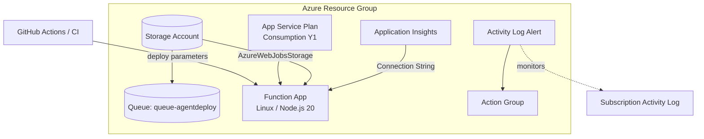

```mermaid
flowchart TB
GH[GitHub Actions / CI]

subgraph Azure["Azure Resource Group"]
SA[(Storage Account)]
Q[(Queue: queue-agentdeploy)]
PLAN[App Service Plan\nConsumption Y1]
FA[Function App\nLinux / Node.js 20]
AI[Application Insights]
AG[Action Group]
AL[Activity Log Alert]
end

GH -->|deploy parameters| FA
SA --> Q
PLAN --> FA
SA -->|AzureWebJobsStorage| FA
AI -->|Connection String| FA
AL --> AG
AL -. monitors .-> SUB[Subscription Activity Log]
```
